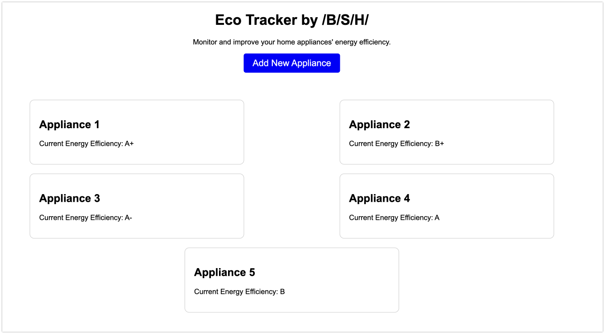

# Definition and characteristics

- **Energy Efficiency Calculation**: The application will calculate the energy efficiency of each appliance based on the provided details and compare them to the most efficient models available in the market.

- **Consumption Tracking**: Users will be able to enter energy consumption readings regularly (e.g., once a month) for each appliance.

- **Data Visualization**: The application will display charts and tables representing the energy consumption of each appliance over time.

- **Alerts and Notifications**: The application will send alerts to users when an appliance is consuming more energy than expected, based on average consumption for its category.

# Possible GCP services

ChatGPT suggestions:

- **Google App Engine**: This is a fully managed web application development and hosting platform. You can use App Engine to host your application, and it will automatically scale to handle incoming web traffic.

- **Google Cloud SQL**: This is a fully managed database service that makes it easy to set up, maintain, manage, and administer your relational databases on Google Cloud. You could use Cloud SQL to store and manage the energy consumption data of appliances.

- **Google Cloud Storage**: This is an object storage service for any amount of data in any format. It could be useful for storing long-term data or data that doesn't need to be in a SQL database.

- **Google Kubernetes Engine (GKE)**: If you decide to containerize your application, GKE could be helpful for container orchestration.

- **Google Cloud Functions**: If you decide to use a microservices or serverless architecture, you could use Cloud Functions to handle specific functions such as calculating energy consumption or sending alerts.

- **Google Cloud Pub/Sub**: This is a real-time messaging and event streaming service. It could be useful if you need to handle real-time events, such as changes in energy consumption.

- **Google Cloud Dataflow / BigQuery**: If you decide to process large amounts of data for analysis, these services could be useful. BigQuery is a large-scale, fully-managed data warehouse that lets you quickly run SQL queries on large amounts of data. Dataflow is a fully-managed stream and batch data processing service.

- **Google Cloud Monitoring / Logging**: These services allow you to log and monitor the application, which could be useful for error detection and performance monitoring.

# UI design

The user interface design should be simple and user-friendly.

- **Home page**: This page will welcome users and provide them with an overview of the application. It will also have links to the other pages of the application.

    A clean design with a brief summary of what the application does. There could be a section with the registered appliances and their current energy efficiency. It could also include a prominent button to register a new appliance.

- **Appliance registration page**: On this page, users will be able to register a new appliance. It will have a form with fields for the brand, model, and purchase date.

    A simple form to register a new appliance. The fields could include: appliance type, brand, model, and purchase date.

- **Consumption tracking page**: On this page, users will be able to enter energy consumption readings for each appliance. It will also display a chart showing energy consumption over time.

    This page could have a table or list of the registered appliances. For each appliance, the user could enter a new energy consumption reading. This page could also display a bar or line chart showing energy consumption over time.

- **Energy efficiency page**: This page will calculate the energy efficiency of each appliance and compare it to the most efficient models.

    This page could display a table or list of appliances, along with a calculated energy efficiency rating for each. It could also include a bar chart comparing the user's appliances' energy efficiency to that of the most efficient models in the market.

- **Alerts and notifications page**: This page will display alerts and notifications sent by the application to the user.

    This page could have a list of recent alerts and notifications sent by the application. It could also include an option to configure the type of alerts the user wishes to receive.

